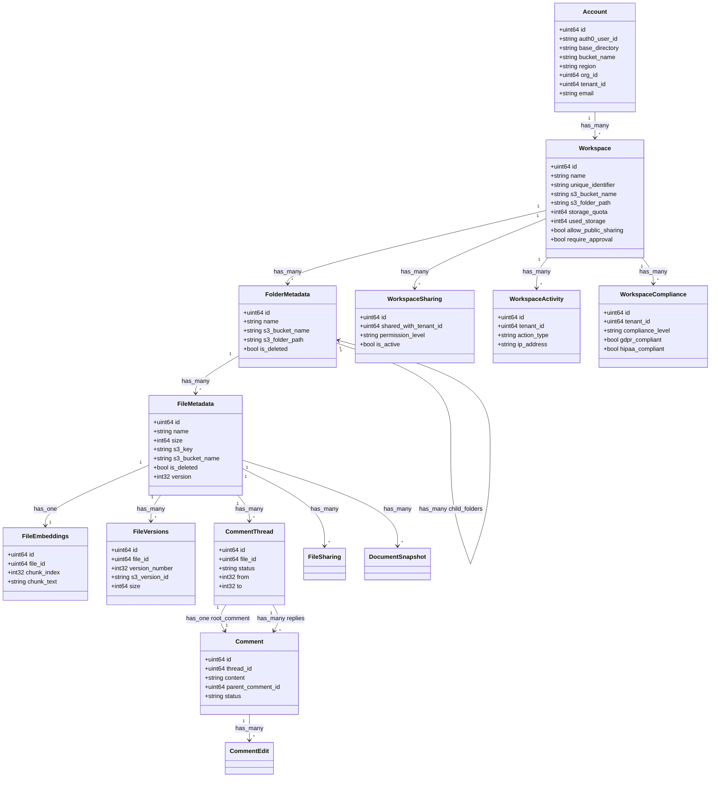

# Workspace Service Documentation

## Overview

This service provides a hierarchical workspace service for the platform. It supports a variety of workspace features, including workspaces, folders, files, comments, and more. It also supports a variety of compliance features, including GDPR and HIPAA compliance.

## Core Entities

