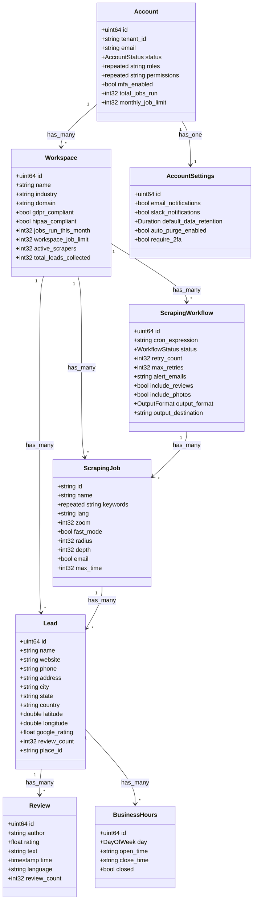

# Lead Scraper Service Documentation

## Overview

This service provides a comprehensive Google Maps business data scraping and lead management system. It supports automated scraping of business information, including contact details, reviews, operating hours, and various business metrics. The service is designed with multi-tenancy support and includes features for compliance, rate limiting, and data enrichment.

## Features

### Data Collection
- **Business Information**: Comprehensive collection of business details including name, contact information, location, and operating hours
- **Rich Media**: Support for collecting photos, business descriptions, and virtual tours
- **Reviews & Ratings**: Detailed review collection with author information, ratings, and sentiment analysis
- **Geographic Data**: Precise location data with latitude/longitude coordinates and address components
- **Business Metrics**: Collection of key business indicators like rating distribution, review count, and popularity metrics

### Automation & Scheduling
- **Workflow Management**: Create and manage recurring scraping tasks with customizable schedules
- **Smart Throttling**: Automatic rate limiting and request throttling to avoid detection
- **Proxy Support**: Built-in proxy rotation and management for reliable data collection
- **Failure Recovery**: Automatic retry mechanisms with configurable backoff strategies
- **Job Monitoring**: Real-time monitoring of scraping jobs with detailed status reporting

### Data Processing
- **Data Enrichment**: Automatic enrichment with additional business metrics and industry classifications
- **Validation & Cleaning**: Built-in data validation and cleaning pipelines
- **Deduplication**: Intelligent deduplication of business entries across multiple sources
- **Format Conversion**: Support for multiple output formats including JSON, CSV, and direct database insertion
- **Custom Processing**: Pluggable processing pipeline for custom data transformations

### Integration & Export
- **Multiple Output Formats**: Support for JSON, CSV, PostgreSQL, and BigQuery exports
- **Webhook Notifications**: Real-time notifications for job status and data availability
- **API Access**: RESTful API for programmatic access to scraped data
- **Streaming Updates**: Real-time data streaming capabilities for live integrations
- **Custom Integrations**: Support for custom integration endpoints

### Security & Compliance
- **Multi-tenancy**: Complete isolation between different tenant workspaces
- **Access Control**: Role-based access control with fine-grained permissions
- **Audit Logging**: Comprehensive audit trails for all system operations
- **Data Privacy**: GDPR and HIPAA compliance features built-in
- **Data Retention**: Configurable data retention policies with automatic cleanup

## Configuration

### Account Settings
```yaml
notifications:
  email: true/false
  slack: true/false
  webhook_url: string
  alert_threshold: float

security:
  require_2fa: true/false
  session_timeout: duration
  ip_whitelist: [string]

data_retention:
  default_retention_period: duration
  auto_purge: true/false
  backup_enabled: true/false
```

### Scraping Configuration
```yaml
job_settings:
  max_concurrent_jobs: int
  default_timeout: duration
  retry_attempts: int
  proxy_enabled: true/false

rate_limits:
  requests_per_second: int
  max_daily_requests: int
  cooldown_period: duration

output_settings:
  format: json/csv/bigquery/postgres
  compression: none/gzip/snappy
  batch_size: int
```

## Usage Examples

### Creating a Scraping Workflow
```protobuf
message CreateWorkflowRequest {
    string name = 1;
    string cron_expression = 2;
    repeated string keywords = 3;
    string geographic_area = 4;
    WorkflowConfig config = 5;
}

// Example configuration
{
    "name": "Coffee Shops SF",
    "cron_expression": "0 0 * * *",
    "keywords": ["coffee", "cafe", "espresso"],
    "geographic_area": "San Francisco, CA",
    "config": {
        "include_reviews": true,
        "include_photos": true,
        "depth": 2,
        "radius_km": 5
    }
}
```

### Retrieving Lead Data
```protobuf
message GetLeadRequest {
    string lead_id = 1;
    bool include_reviews = 2;
    bool include_hours = 3;
    bool include_photos = 4;
}

// Example response
{
    "lead": {
        "id": "123",
        "name": "Artisan Coffee Co",
        "address": "123 Main St, San Francisco, CA",
        "rating": 4.5,
        "reviews": [...],
        "hours": {...},
        "photos": [...]
    }
}
```

## Technical Details

### Core Entities



### Performance Considerations

- **Rate Limiting**: The service implements intelligent rate limiting to avoid detection and maintain service stability
- **Caching**: Multi-level caching strategy for frequently accessed data
- **Database Optimization**: Indexed fields and optimized queries for high-performance data retrieval
- **Batch Processing**: Efficient batch processing for large-scale data operations
- **Resource Management**: Dynamic resource allocation based on workload

### Error Handling

The service implements comprehensive error handling:

1. **Retryable Errors**:
   - Network timeouts
   - Rate limiting responses
   - Temporary service unavailability

2. **Non-Retryable Errors**:
   - Invalid authentication
   - Malformed requests
   - Permanent resource unavailability

3. **Error Recovery**:
   - Automatic retry with exponential backoff
   - Circuit breaker pattern for external services
   - Dead letter queues for failed jobs

### Monitoring & Logging

The service provides comprehensive monitoring capabilities:

1. **Metrics**:
   - Job success/failure rates
   - Processing latency
   - Resource utilization
   - Error rates and types

2. **Logging**:
   - Structured logging with correlation IDs
   - Audit logs for security events
   - Performance traces
   - Debug logs for troubleshooting

3. **Alerts**:
   - Job failure notifications
   - Resource utilization alerts
   - Error rate thresholds
   - SLA breach notifications

## API Reference

For detailed API documentation, please refer to the generated Protocol Buffer documentation or explore the following resources:

- [API Documentation](./api-docs)
- [Proto Definitions](./proto)
- [Example Code](./examples)
- [Client Libraries](./clients)

## Advanced Features

### Intelligent Scraping
- **Smart Geolocation**: 
  - Automatic coordinate grid generation for comprehensive area coverage
  - Adaptive radius adjustment based on business density
  - Support for polygon-based geographic boundaries
  - Multiple coordinate systems (WGS84, local projections)

- **Content Analysis**:
  - Natural language processing for review sentiment analysis
  - Business category classification using ML models
  - Automated phone and email validation
  - Image analysis for business photos
  - Opening hours pattern recognition

- **Anti-Detection Measures**:
  - Dynamic user agent rotation
  - Browser fingerprint randomization
  - Request pattern naturalization
  - IP geolocation matching
  - Session cookie management
  - Request header randomization

### Data Quality
- **Validation Rules**:
  ```yaml
  business_name:
    min_length: 2
    max_length: 100
    required: true
    pattern: "^[\\w\\s\\-\\.,'&]+$"

  phone_number:
    formats:
      - "^\\+[1-9]\\d{1,14}$"  # E.164 format
      - "^\\(\\d{3}\\) \\d{3}-\\d{4}$"  # US format
    validation: "phone_number_validator"
    required: false

  website:
    format: "url"
    protocols: ["http", "https"]
    validate_ssl: true
    follow_redirects: true
    max_redirects: 5

  email:
    format: "email"
    mx_check: true
    disposable_check: true
    role_address_check: true
  ```

- **Deduplication Strategy**:
  ```yaml
  deduplication_rules:
    exact_match:
      - place_id
      - google_maps_url
    fuzzy_match:
      business_name:
        algorithm: "levenshtein"
        threshold: 0.85
      address:
        algorithm: "address_normalizer"
        threshold: 0.9
    composite_match:
      - rules: ["phone", "website"]
        operator: "OR"
      - rules: ["name", "address", "zip"]
        operator: "AND"
  ```

### Advanced Workflow Configuration
```yaml
workflow_advanced:
  scheduling:
    timezone: "UTC"
    blackout_periods:
      - start: "23:00"
        end: "05:00"
    priority_hours:
      - start: "10:00"
        end: "16:00"
        weight: 2.0
    
  throttling:
    dynamic_adjustment:
      enabled: true
      metrics:
        - error_rate
        - response_time
        - success_ratio
      cooldown_factor: 1.5
      
  proxy_management:
    rotation:
      strategy: "round_robin|random|smart"
      interval: "request|time|error"
      error_threshold: 5
    proxy_types:
      - type: "residential"
        weight: 0.7
      - type: "datacenter"
        weight: 0.3
        
  error_handling:
    retry_strategies:
      network_timeout:
        max_attempts: 3
        backoff:
          initial: 1000
          multiplier: 2
          max: 10000
      rate_limit:
        max_attempts: 5
        backoff:
          initial: 60000
          multiplier: 1.5
          max: 300000
          
  data_enrichment:
    providers:
      - name: "clearbit"
        priority: 1
        fields: ["company_info", "social_profiles"]
      - name: "zoominfo"
        priority: 2
        fields: ["employee_count", "revenue"]
```

## Deployment Guide

### System Requirements
- **Hardware Requirements**:
  ```yaml
  minimum:
    cpu: 4 cores
    memory: 8GB
    storage: 100GB SSD
  recommended:
    cpu: 8 cores
    memory: 16GB
    storage: 500GB SSD
  scaling_factor:
    per_concurrent_job: 0.5 core
    per_1000_leads: 1GB memory
  ```

- **Software Dependencies**:
  ```yaml
  runtime:
    golang: ">=1.19"
    python: ">=3.9"
  databases:
    postgresql: ">=13"
    redis: ">=6.0"
  infrastructure:
    kubernetes: ">=1.22"
    docker: ">=20.10"
  monitoring:
    prometheus: ">=2.30"
    grafana: ">=8.0"
  ```

### Deployment Options

1. **Kubernetes Deployment**:
```yaml
resources:
  requests:
    cpu: "2"
    memory: "4Gi"
  limits:
    cpu: "4"
    memory: "8Gi"

scaling:
  horizontal:
    min_replicas: 2
    max_replicas: 10
    target_cpu_utilization: 70
    target_memory_utilization: 80

storage:
  persistent_volume:
    size: "100Gi"
    storage_class: "ssd"
    backup_policy: "daily"

networking:
  service:
    type: LoadBalancer
    ports:
      - name: http
        port: 80
        targetPort: 8080
      - name: grpc
        port: 9090
        targetPort: 9090
```

2. **Docker Compose Setup**:
```yaml
version: '3.8'
services:
  lead-scraper:
    build: .
    environment:
      - DB_HOST=postgres
      - REDIS_HOST=redis
      - LOG_LEVEL=info
    depends_on:
      - postgres
      - redis
    ports:
      - "8080:8080"
      - "9090:9090"

  postgres:
    image: postgres:13
    environment:
      - POSTGRES_DB=leads
      - POSTGRES_USER=scraper
      - POSTGRES_PASSWORD_FILE=/run/secrets/db_password
    volumes:
      - postgres_data:/var/lib/postgresql/data

  redis:
    image: redis:6
    command: ["redis-server", "--appendonly", "yes"]
    volumes:
      - redis_data:/data
```

## Best Practices

### Rate Limiting Strategy
```yaml
rate_limiting:
  global:
    requests_per_second: 10
    burst: 20
  per_ip:
    requests_per_minute: 30
    burst: 10
  per_domain:
    requests_per_hour: 1000
    cooldown_minutes: 60
  
  adaptive:
    enabled: true
    factors:
      success_rate:
        weight: 0.4
        threshold: 0.95
      response_time:
        weight: 0.3
        threshold_ms: 500
      error_rate:
        weight: 0.3
        threshold: 0.05
```

### Data Privacy Compliance
```yaml
privacy_settings:
  data_retention:
    personal_data: 90  # days
    business_data: 365  # days
    audit_logs: 730  # days
  
  anonymization:
    fields:
      - name: "email"
        method: "hash"
      - name: "phone"
        method: "partial_mask"
      - name: "address"
        method: "generalize"
  
  consent_management:
    required_for:
      - data_collection
      - data_sharing
      - marketing
    expiration: 365  # days
    
  access_control:
    roles:
      admin:
        - "read:*"
        - "write:*"
        - "delete:*"
      analyst:
        - "read:*"
        - "write:reports"
      viewer:
        - "read:reports"
        - "read:metrics"
```

## Troubleshooting Guide

### Common Issues and Solutions

1. **Rate Limiting Detection**
   ```yaml
   symptoms:
     - Increased error rates
     - HTTP 429 responses
     - IP blocks
   solutions:
     - Decrease concurrent requests
     - Implement exponential backoff
     - Rotate IP addresses
     - Adjust request patterns
   ```

2. **Data Quality Issues**
   ```yaml
   symptoms:
     - Missing fields
     - Invalid formats
     - Duplicate entries
   solutions:
     - Validate input data
     - Implement retry logic
     - Enhance deduplication rules
     - Update parsing patterns
   ```

3. **Performance Degradation**
   ```yaml
   symptoms:
     - Increased latency
     - High resource usage
     - Timeout errors
   solutions:
     - Scale horizontally
     - Optimize queries
     - Enable caching
     - Adjust batch sizes
   ```

### Monitoring Checklist

```yaml
daily_checks:
  - name: "Success Rate"
    threshold: ">95%"
    alert_channel: "slack"
  
  - name: "Error Rate"
    threshold: "<5%"
    alert_channel: "email"
  
  - name: "Data Quality"
    metrics:
      - "completeness"
      - "accuracy"
      - "freshness"
    threshold: ">90%"
  
  - name: "Resource Usage"
    metrics:
      - "cpu_utilization"
      - "memory_usage"
      - "disk_space"
    threshold: "<80%"
```

## Integration Examples

### Webhook Integration
```javascript
const webhook = {
  url: "https://api.example.com/webhook",
  events: ["job.completed", "lead.created", "error.critical"],
  payload: {
    job_id: "string",
    status: "string",
    timestamp: "datetime",
    data: {
      leads_count: "integer",
      success_rate: "float",
      duration: "integer"
    }
  },
  retry_config: {
    max_attempts: 3,
    backoff_factor: 2,
    initial_delay: 1000
  }
};
```

### API Client Example
```python
from lead_scraper import LeadScraperClient

client = LeadScraperClient(
    api_key="your-api-key",
    base_url="https://api.lead-scraper.example.com",
    timeout=30,
    retry_attempts=3
)

# Create a scraping workflow
workflow = client.create_workflow(
    name="Tech Startups Bay Area",
    keywords=["startup", "technology", "software"],
    location="San Francisco Bay Area",
    radius_km=50,
    config={
        "include_reviews": True,
        "min_rating": 4.0,
        "max_results": 1000
    }
)

# Start the workflow
job = workflow.start()

# Monitor progress
status = job.get_status()
while status.is_running():
    print(f"Progress: {status.progress}%")
    time.sleep(60)
    status = job.get_status()

# Get results
results = job.get_results()
for lead in results.leads:
    print(f"Found: {lead.name} ({lead.rating}★)")
```
