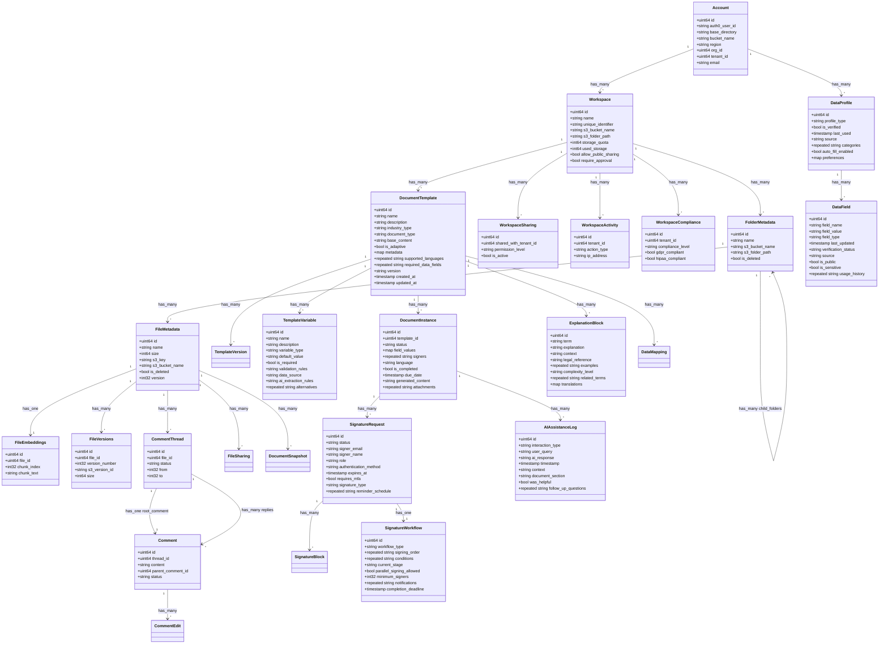

# Workspace Service Documentation

## Overview

This service provides a hierarchical workspace service for the platform, with specialized support for intelligent contract management and e-signature workflows. It supports a variety of workspace features, including workspaces, folders, files, comments, and more. It also supports a variety of compliance features, including GDPR and HIPAA compliance.

## Contract Management Features

### Smart Template Management
- **AI-Powered Template Creation**:
  - Extract templates from existing signed documents
  - Intelligent variable detection and replacement
  - Dynamic field identification
  - Template versioning and history
  - Context-aware variable mapping

- **Adaptive Templates**:
  - Context-aware document customization
  - Dynamic clause selection
  - Automatic formatting adjustment
  - Conditional section inclusion
  - Smart field validation

### Intelligent Document Processing
- **Auto-Fill Capabilities**:
  - Historical data integration
  - Public data source integration
  - Company information auto-population
  - Smart field mapping
  - Cross-document data reuse

- **AI Assistant Integration**:
  - Voice-guided document completion
  - Term and condition explanation
  - Legal clause clarification
  - Context-aware suggestions
  - Multi-language support

### E-Signature Workflow
- **Smart Routing**:
  - Role-based signature workflows
  - Parallel and sequential signing
  - Automatic reminder system
  - Deadline tracking
  - Conditional routing logic

- **Signature Verification**:
  - Multi-factor authentication
  - Biometric verification
  - Audit trail generation
  - Compliance validation
  - Timestamp certification

### Advanced AI Features
- **Semantic Understanding**:
  - Natural language contract parsing
  - Intent recognition
  - Obligation extraction
  - Risk assessment
  - Clause similarity analysis
  - Legal requirement validation

- **Context-Aware Processing**:
  - Industry-specific term detection
  - Jurisdiction-based compliance
  - Market condition adaptation
  - Regulatory update integration
  - Business context awareness

- **Intelligent Negotiation Support**:
  - Clause suggestion engine
  - Term optimization
  - Risk-benefit analysis
  - Alternative wording proposals
  - Historical negotiation insights
  - Market standard comparisons

### Document Intelligence
- **Smart Analysis**:
  - Contract value assessment
  - Risk scoring
  - Compliance probability
  - Execution complexity
  - Performance indicators
  - Obligation tracking

- **Pattern Recognition**:
  - Similar contract identification
  - Common modification patterns
  - Negotiation trend analysis
  - Standard term detection
  - Anomaly identification

- **Predictive Features**:
  - Approval time estimation
  - Negotiation duration prediction
  - Risk probability assessment
  - Cost implication analysis
  - Performance forecasting

### Smart Document System
- **Version Control**:
  - Git-like branching and merging
  - Semantic versioning
  - Conflict resolution
  - Change history tracking
  - Differential comparisons
  - Rollback capabilities

- **Smart Diffing**:
  ```yaml
  diff_features:
    semantic_diff:
      - clause_level_changes
      - intent_changes
      - risk_impact_analysis
      - obligation_changes
      - terminology_changes
    
    visual_diff:
      - formatting_changes
      - structural_changes
      - style_modifications
      - layout_adjustments
    
    content_diff:
      - text_changes
      - variable_modifications
      - metadata_updates
      - reference_changes
  ```

- **Branch Management**:
  ```yaml
  branch_management:
    types:
      - main: "Primary approved version"
      - review: "Under legal review"
      - negotiate: "Active negotiation"
      - template: "Template variations"
      - custom: "Client specific"
    
    policies:
      merge_requirements:
        - legal_approval
        - compliance_check
        - risk_assessment
        - stakeholder_sign_off
      
    automation:
      - auto_merge_non_conflicting
      - conflict_detection
      - impact_assessment
      - notification_triggers
  ```

### Contextual Intelligence
- **Smart Summaries**:
  ```yaml
  summary_types:
    executive:
      focus: "Key business terms"
      length: "1-2 pages"
      includes:
        - financial_implications
        - key_obligations
        - critical_dates
        - risk_factors
    
    legal:
      focus: "Legal implications"
      length: "Comprehensive"
      includes:
        - legal_obligations
        - compliance_requirements
        - jurisdiction_specifics
        - precedent_references
    
    operational:
      focus: "Implementation details"
      length: "Action-oriented"
      includes:
        - timelines
        - responsibilities
        - deliverables
        - operational_requirements
  ```

- **Context Awareness**:
  ```yaml
  context_features:
    document_context:
      - business_relationship
      - industry_sector
      - transaction_type
      - jurisdiction
      - regulatory_framework
    
    user_context:
      - role_based_views
      - expertise_level
      - language_preference
      - access_permissions
    
    situational_context:
      - negotiation_stage
      - urgency_level
      - business_climate
      - market_conditions
  ```

### Enhanced Template System
- **Dynamic Generation**:
  ```yaml
  template_generation:
    ai_capabilities:
      - semantic_understanding
      - context_awareness
      - style_matching
      - complexity_adaptation
      - terminology_standardization
    
    learning_features:
      - success_rate_tracking
      - user_preference_learning
      - industry_pattern_recognition
      - negotiation_outcome_analysis
      
    optimization_rules:
      - readability_enhancement
      - risk_minimization
      - compliance_maximization
      - efficiency_optimization
  ```

- **Intelligent Variable System**:
  ```yaml
  variable_system:
    smart_detection:
      - context_based_identification
      - pattern_recognition
      - semantic_analysis
      - dependency_mapping
    
    dynamic_validation:
      - business_rule_enforcement
      - regulatory_compliance_check
      - cross_reference_validation
      - logical_consistency_check
    
    value_suggestion:
      - historical_data_analysis
      - market_standard_alignment
      - risk_based_optimization
      - context_aware_defaults
  ```

### Advanced Integration Features
- **Ecosystem Connectivity**:
  ```yaml
  integrations:
    enterprise_systems:
      - name: "SAP"
        data_mapping:
          - entity: "business_partner"
            fields: ["id", "name", "tax_id"]
          - entity: "contract"
            fields: ["type", "value", "terms"]
      
      - name: "Salesforce"
        data_mapping:
          - entity: "account"
            fields: ["id", "name", "industry"]
          - entity: "opportunity"
            fields: ["stage", "amount", "close_date"]
    
    legal_databases:
      - name: "LexisNexis"
        features: ["case_law", "regulations"]
      - name: "Westlaw"
        features: ["legal_research", "compliance"]
    
    financial_systems:
      - name: "Bloomberg"
        data_types: ["market_data", "risk_metrics"]
      - name: "Thomson Reuters"
        data_types: ["company_data", "financial_metrics"]
  ```

### Enhanced Schema Additions

```mermaid
classDiagram
    %% Core Entities
    Account "1" --> "*" Workspace : has_many
    Workspace "1" --> "*" FolderMetadata : has_many
    Workspace "1" --> "*" WorkspaceSharing : has_many
    Workspace "1" --> "*" WorkspaceActivity : has_many
    Workspace "1" --> "*" WorkspaceCompliance : has_many

    %% Folder and File Structure
    FolderMetadata "1" --> "*" FolderMetadata : has_many child_folders
    FolderMetadata "1" --> "*" FileMetadata : has_many

    %% File Related Entities
    FileMetadata "1" --> "1" FileEmbeddings : has_one
    FileMetadata "1" --> "*" FileVersions : has_many
    FileMetadata "1" --> "*" CommentThread : has_many
    FileMetadata "1" --> "*" FileSharing : has_many
    FileMetadata "1" --> "*" DocumentSnapshot : has_many

    %% Comment System
    CommentThread "1" --> "1" Comment : has_one root_comment
    CommentThread "1" --> "*" Comment : has_many replies
    Comment "1" --> "*" CommentEdit : has_many

    %% Contract Management
    Workspace "1" --> "*" DocumentTemplate : has_many
    DocumentTemplate "1" --> "*" TemplateVersion : has_many
    DocumentTemplate "1" --> "*" TemplateVariable : has_many
    DocumentTemplate "1" --> "*" DocumentInstance : has_many
    
    %% E-Signature Flow
    DocumentInstance "1" --> "*" SignatureRequest : has_many
    SignatureRequest "1" --> "*" SignatureBlock : has_many
    SignatureRequest "1" --> "1" SignatureWorkflow : has_one
    
    %% AI Assistance
    DocumentTemplate "1" --> "*" ExplanationBlock : has_many
    DocumentInstance "1" --> "*" AIAssistanceLog : has_many
    
    %% Data Management
    Account "1" --> "*" DataProfile : has_many
    DataProfile "1" --> "*" DataField : has_many
    DocumentTemplate "1" --> "*" DataMapping : has_many

    %% Advanced Contract Intelligence
    DocumentTemplate "1" --> "*" ContractIntelligence : has_many
    ContractIntelligence "1" --> "*" RiskAssessment : has_many
    ContractIntelligence "1" --> "*" ComplianceCheck : has_many
    
    %% Negotiation Support
    DocumentInstance "1" --> "1" NegotiationHistory : has_one
    NegotiationHistory "1" --> "*" NegotiationRound : has_many
    NegotiationRound "1" --> "*" ProposedChange : has_many
    
    %% Version Control
    DocumentInstance "1" --> "*" DocumentVersion : has_many
    DocumentVersion "1" --> "*" DocumentBranch : has_many
    DocumentBranch "1" --> "*" BranchMerge : has_many
    
    %% Smart Summaries
    DocumentVersion "1" --> "*" ContextualSummary : has_many
    ContextualSummary "1" --> "*" SummarySection : has_many
    
    %% Change Tracking
    DocumentVersion "1" --> "*" ChangeSet : has_many
    ChangeSet "1" --> "*" SemanticDiff : has_many

    %% Add Marketplace Related Entities
    Workspace "1" --> "*" MarketplaceApp : has_many
    MarketplaceApp "1" --> "*" AppVersion : has_many
    MarketplaceApp "1" --> "*" AppInstallation : has_many
    AppInstallation "1" --> "*" AppConfiguration : has_many
    MarketplaceApp "1" --> "*" AppAnalytics : has_many
    MarketplaceApp "1" --> "*" AppReview : has_many
    
    class Account {
        +uint64 id
        +string auth0_user_id
        +string base_directory
        +string bucket_name
        +string region
        +uint64 org_id
        +uint64 tenant_id
        +string email
    }

    class Workspace {
        +uint64 id
        +string name
        +string unique_identifier
        +string s3_bucket_name
        +string s3_folder_path
        +int64 storage_quota
        +int64 used_storage
        +bool allow_public_sharing
        +bool require_approval
    }

    class FolderMetadata {
        +uint64 id
        +string name
        +string s3_bucket_name
        +string s3_folder_path
        +bool is_deleted
    }

    class FileMetadata {
        +uint64 id
        +string name
        +int64 size
        +string s3_key
        +string s3_bucket_name
        +bool is_deleted
        +int32 version
    }

    class CommentThread {
        +uint64 id
        +uint64 file_id
        +string status
        +int32 from
        +int32 to
    }

    class Comment {
        +uint64 id
        +uint64 thread_id
        +string content
        +uint64 parent_comment_id
        +string status
    }

    class FileVersions {
        +uint64 id
        +uint64 file_id
        +int32 version_number
        +string s3_version_id
        +int64 size
    }

    class WorkspaceSharing {
        +uint64 id
        +uint64 shared_with_tenant_id
        +string permission_level
        +bool is_active
    }

    class WorkspaceActivity {
        +uint64 id
        +uint64 tenant_id
        +string action_type
        +string ip_address
    }

    class WorkspaceCompliance {
        +uint64 id
        +uint64 tenant_id
        +string compliance_level
        +bool gdpr_compliant
        +bool hipaa_compliant
    }

    class FileEmbeddings {
        +uint64 id
        +uint64 file_id
        +int32 chunk_index
        +string chunk_text
    }

    class DocumentTemplate {
        +uint64 id
        +string name
        +string description
        +string industry_type
        +string document_type
        +string base_content
        +bool is_adaptive
        +map<string,string> metadata
        +repeated string supported_languages
        +repeated string required_data_fields
        +string version
        +timestamp created_at
        +timestamp updated_at
    }

    class TemplateVariable {
        +uint64 id
        +string name
        +string description
        +string variable_type
        +string default_value
        +bool is_required
        +string validation_rules
        +string data_source
        +string ai_extraction_rules
        +repeated string alternatives
    }

    class DocumentInstance {
        +uint64 id
        +uint64 template_id
        +string status
        +map<string,string> field_values
        +repeated string signers
        +string language
        +bool is_completed
        +timestamp due_date
        +string generated_content
        +repeated string attachments
    }

    class SignatureRequest {
        +uint64 id
        +string status
        +string signer_email
        +string signer_name
        +string role
        +string authentication_method
        +timestamp expires_at
        +bool requires_mfa
        +string signature_type
        +repeated string reminder_schedule
    }

    class SignatureWorkflow {
        +uint64 id
        +string workflow_type
        +repeated string signing_order
        +repeated string conditions
        +string current_stage
        +bool parallel_signing_allowed
        +int32 minimum_signers
        +repeated string notifications
        +timestamp completion_deadline
    }

    class DataProfile {
        +uint64 id
        +string profile_type
        +bool is_verified
        +timestamp last_used
        +string source
        +repeated string categories
        +bool auto_fill_enabled
        +map<string,string> preferences
    }

    class DataField {
        +uint64 id
        +string field_name
        +string field_value
        +string field_type
        +timestamp last_updated
        +string verification_status
        +string source
        +bool is_public
        +bool is_sensitive
        +repeated string usage_history
    }

    class ExplanationBlock {
        +uint64 id
        +string term
        +string explanation
        +string context
        +string legal_reference
        +repeated string examples
        +string complexity_level
        +repeated string related_terms
        +map<string,string> translations
    }

    class AIAssistanceLog {
        +uint64 id
        +string interaction_type
        +string user_query
        +string ai_response
        +timestamp timestamp
        +string context
        +string document_section
        +bool was_helpful
        +repeated string follow_up_questions
    }

    class ContractIntelligence {
        +uint64 id
        +string contract_type
        +map<string,float> risk_scores
        +map<string,string> detected_clauses
        +repeated string key_obligations
        +map<string,float> compliance_scores
        +string jurisdiction
        +repeated string governing_laws
        +map<string,string> semantic_analysis
        +timestamp analysis_date
    }

    class RiskAssessment {
        +uint64 id
        +string risk_type
        +float risk_score
        +string risk_description
        +repeated string mitigation_suggestions
        +map<string,float> impact_analysis
        +repeated string affected_parties
        +timestamp assessment_date
        +string assessor_model
    }

    class ComplianceCheck {
        +uint64 id
        +string regulation_type
        +bool is_compliant
        +repeated string violations
        +repeated string required_actions
        +map<string,string> compliance_details
        +timestamp check_date
        +string jurisdiction
    }

    class NegotiationHistory {
        +uint64 id
        +int32 rounds_count
        +timestamp start_date
        +timestamp end_date
        +string final_status
        +repeated string key_changes
        +map<string,string> negotiation_metrics
        +float success_rate
    }

    class NegotiationRound {
        +uint64 id
        +int32 round_number
        +timestamp round_date
        +string proposer_party
        +string round_status
        +repeated string proposed_changes
        +repeated string acceptances
        +repeated string rejections
        +map<string,string> discussion_points
    }

    class ProposedChange {
        +uint64 id
        +string clause_reference
        +string original_text
        +string proposed_text
        +string change_rationale
        +float acceptance_probability
        +repeated string similar_precedents
        +map<string,float> impact_analysis
        +string ai_recommendation
    }

    class DocumentVersion {
        +uint64 id
        +string version_hash
        +string parent_hash
        +string commit_message
        +timestamp created_at
        +string author_id
        +string branch_name
        +map<string,string> metadata
        +repeated string tags
        +bool is_approved
        +string approval_chain
    }

    class DocumentBranch {
        +uint64 id
        +string name
        +string base_version_hash
        +string current_head_hash
        +string purpose
        +string status
        +repeated string reviewers
        +map<string,string> branch_metadata
        +timestamp last_updated
        +bool is_locked
    }

    class BranchMerge {
        +uint64 id
        +string source_branch
        +string target_branch
        +string merge_strategy
        +string conflict_resolution
        +repeated string approvers
        +timestamp merge_time
        +bool is_successful
        +string merge_notes
    }

    class ContextualSummary {
        +uint64 id
        +string summary_type
        +string target_audience
        +string language
        +int32 complexity_level
        +map<string,string> key_points
        +repeated string highlights
        +timestamp generated_at
        +float confidence_score
    }

    class SummarySection {
        +uint64 id
        +string section_type
        +string content
        +int32 priority_level
        +repeated string related_clauses
        +map<string,float> relevance_scores
        +bool requires_attention
        +string action_items
    }

    class ChangeSet {
        +uint64 id
        +string change_type
        +string description
        +map<string,string> modified_elements
        +repeated string affected_sections
        +float impact_score
        +string semantic_meaning
        +timestamp change_time
        +bool requires_review
    }

    class SemanticDiff {
        +uint64 id
        +string diff_type
        +string original_text
        +string modified_text
        +float similarity_score
        +map<string,float> impact_analysis
        +repeated string affected_obligations
        +string change_category
        +bool is_material_change
    }

    class MarketplaceApp {
        +uint64 id
        +string name
        +string description
        +string developer_id
        +string category
        +repeated string supported_contract_types
        +repeated string features
        +string pricing_model
        +map<string,float> pricing_tiers
        +repeated string supported_integrations
        +bool is_verified
        +float rating
        +int32 installation_count
        +timestamp published_at
        +timestamp last_updated
        +string status
        +repeated string required_permissions
        +map<string,string> metadata
    }

    class AppVersion {
        +uint64 id
        +string version_number
        +string changelog
        +string compatibility_requirements
        +repeated string new_features
        +repeated string bug_fixes
        +string deployment_script
        +string rollback_script
        +timestamp release_date
        +bool is_public
        +string status
    }

    class AppInstallation {
        +uint64 id
        +uint64 workspace_id
        +uint64 app_id
        +string version
        +string status
        +timestamp installed_at
        +timestamp last_used
        +map<string,string> configuration
        +repeated string enabled_features
        +string license_key
        +timestamp license_expiry
        +map<string,float> usage_metrics
    }

    class AppConfiguration {
        +uint64 id
        +string config_type
        +map<string,string> settings
        +repeated string integration_endpoints
        +map<string,string> credentials
        +repeated string webhook_urls
        +bool is_active
        +timestamp last_modified
        +string modified_by
        +string validation_status
    }

    class AppAnalytics {
        +uint64 id
        +uint64 app_id
        +string metric_type
        +float metric_value
        +timestamp recorded_at
        +string dimension
        +map<string,float> breakdown
        +repeated string labels
        +string source
    }

    class AppReview {
        +uint64 id
        +uint64 app_id
        +uint64 user_id
        +float rating
        +string review_text
        +repeated string pros
        +repeated string cons
        +int32 helpful_count
        +timestamp created_at
        +bool is_verified_purchase
        +string usage_context
        +repeated string feature_ratings
    }
```



## Features

### Workspace Management
- **Hierarchical Organization**: 
  - Multi-level folder structures
  - Flexible file organization
  - Customizable workspace templates
  - Bulk operations support
  - Path-based navigation

- **Version Control**:
  - File versioning with history
  - Automatic version tracking
  - Restore previous versions
  - Version comparison
  - Change tracking

- **Collaboration Tools**:
  - Real-time commenting
  - Thread-based discussions
  - @mentions and notifications
  - Shared workspaces
  - Activity tracking

### File Operations
- **File Management**:
  - Multi-format support
  - Chunked uploads/downloads
  - File metadata tracking
  - Content indexing
  - File locking

- **Search & Discovery**:
  - Full-text search
  - Metadata-based filtering
  - Tag-based organization
  - Smart folders
  - Recent files tracking

- **Content Processing**:
  - Automatic file type detection
  - Content preview generation
  - Text extraction
  - Metadata extraction
  - File embeddings generation

### Security & Compliance
- **Access Control**:
  - Role-based permissions
  - Fine-grained access control
  - Workspace isolation
  - IP-based restrictions
  - Session management

- **Compliance Features**:
  - GDPR compliance tools
  - HIPAA compliance support
  - Audit logging
  - Data retention policies
  - Data export tools

## Configuration

### Workspace Settings
```yaml
storage:
  provider: "s3"
  bucket_naming: "tenant-${workspace_id}"
  region: "us-west-2"
  versioning: true
  lifecycle_rules:
    - transition_glacier_days: 90
    - expiration_days: 365

permissions:
  default_role: "viewer"
  available_roles:
    - admin
    - editor
    - viewer
  custom_roles: true
  inheritance: true

file_handling:
  max_file_size: 5GB
  allowed_extensions: ["*"]
  blocked_extensions: ["exe", "bat"]
  virus_scan: true
  deduplication: true
```

### Compliance Configuration
```yaml
compliance:
  gdpr:
    enabled: true
    data_retention_days: 90
    right_to_forget: true
    data_portability: true
    
  hipaa:
    enabled: true
    encryption_at_rest: true
    audit_logging: true
    access_monitoring: true
    
  audit:
    log_retention_days: 365
    detailed_logging: true
    user_tracking: true
```

### Contract App Marketplace
- **App Management**:
  ```yaml
  app_types:
    contract_automation:
      - workflow_automation
      - approval_routing
      - notification_systems
      - custom_validations
    
    contract_analysis:
      - risk_analysis
      - compliance_checking
      - cost_calculation
      - performance_tracking
    
    integration_apps:
      - crm_connectors
      - erp_integrations
      - payment_systems
      - document_management
    
    ai_powered:
      - smart_templates
      - clause_libraries
      - negotiation_assistants
      - summary_generators
  ```

- **Marketplace Features**:
  ```yaml
  marketplace:
    discovery:
      - categories
      - ratings
      - reviews
      - popularity_metrics
      - search_functionality
    
    deployment:
      - one_click_install
      - configuration_wizard
      - dependency_management
      - version_control
    
    monetization:
      - subscription_plans
      - usage_based_pricing
      - trial_periods
      - enterprise_licensing
    
    security:
      - app_verification
      - sandbox_environment
      - permission_scoping
      - data_access_control
  ```

### App Integration Configuration
```yaml
app_integration:
  permissions:
    scopes:
      - contract.read
      - contract.write
      - template.manage
      - workflow.execute
      - analytics.view
    
    access_levels:
      - name: "basic"
        allowed_scopes: ["contract.read", "analytics.view"]
      - name: "advanced"
        allowed_scopes: ["contract.*", "template.manage"]
      - name: "admin"
        allowed_scopes: ["*"]

  webhooks:
    events:
      - contract.created
      - contract.updated
      - contract.signed
      - workflow.completed
    
    delivery:
      retry_count: 3
      timeout: 30s
      signature_header: "X-App-Signature"

  api_access:
    rate_limits:
      basic: 100
      advanced: 1000
      admin: 5000
    
    authentication:
      type: "oauth2"
      token_expiry: 3600
      refresh_enabled: true
```

### App Development Guidelines
```yaml
development:
  sdk_support:
    languages:
      - python
      - javascript
      - java
      - go
    
    features:
      - api_client_generation
      - webhook_handlers
      - testing_utilities
      - mock_data_generation
    
  testing_requirements:
    coverage:
      minimum_percentage: 80
      critical_paths: 100
    
    security:
      - vulnerability_scan
      - dependency_audit
      - penetration_testing
    
    performance:
      - load_testing
      - stress_testing
      - scalability_verification
```

## Usage Examples

### Creating a Workspace
```protobuf
message CreateWorkspaceRequest {
    string name = 1;
    string description = 2;
    WorkspaceSettings settings = 3;
    repeated string user_ids = 4;
}

// Example configuration
{
    "name": "Project Alpha",
    "description": "Main project workspace",
    "settings": {
        "storage_quota": 100GB,
        "allow_public_sharing": false,
        "require_approval": true,
        "default_permission": "viewer"
    },
    "user_ids": ["user1", "user2"]
}
```

### File Operations
```protobuf
message FileOperationRequest {
    string workspace_id = 1;
    string file_path = 2;
    FileOperation operation = 3;
    FileMetadata metadata = 4;
}

// Example operations
{
    "upload": {
        "workspace_id": "ws_123",
        "file_path": "/documents/report.pdf",
        "metadata": {
            "content_type": "application/pdf",
            "tags": ["report", "2023", "final"],
            "custom_metadata": {
                "department": "finance",
                "status": "draft"
            }
        }
    },
    "move": {
        "workspace_id": "ws_123",
        "source_path": "/old/location.txt",
        "target_path": "/new/location.txt",
        "preserve_metadata": true
    }
}
```

## Core Entities



## Advanced Features

### Search & Indexing
- **Full-Text Search**:
  - Real-time indexing
  - Fuzzy matching
  - Relevance scoring
  - Field-specific search
  - Advanced query syntax

- **Metadata Search**:
  - Custom metadata fields
  - Range queries
  - Aggregations
  - Faceted search
  - Sort options

### Collaboration Features
- **Comments & Discussions**:
  - Threaded comments
  - Rich text formatting
  - File attachments
  - @mentions
  - Email notifications

- **Activity Tracking**:
  - User activity feed
  - File change history
  - Access logs
  - Collaboration metrics
  - Usage analytics

### Storage Management
- **Quota Management**:
  - Per-workspace quotas
  - Usage tracking
  - Quota notifications
  - Auto-cleanup policies
  - Storage optimization

- **File Lifecycle**:
  - Automatic archiving
  - Version pruning
  - Temporary file cleanup
  - Retention policies
  - Recovery options

## Best Practices

### Performance Optimization
```yaml
caching:
  enabled: true
  layers:
    - memory:
        max_size: 1GB
        ttl: 3600
    - redis:
        max_size: 10GB
        ttl: 86400
  
  strategies:
    metadata:
      ttl: 300
      invalidation: "write-through"
    content:
      ttl: 3600
      invalidation: "write-around"
    search:
      ttl: 1800
      invalidation: "write-back"

indexing:
  batch_size: 1000
  concurrent_indexers: 4
  priority_queue: true
  update_threshold: 100
```

### Security Guidelines
```yaml
security:
  authentication:
    session_timeout: 3600
    max_sessions: 5
    mfa_required: true
    
  authorization:
    cache_ttl: 300
    refresh_interval: 60
    default_deny: true
    
  encryption:
    algorithm: "AES-256-GCM"
    key_rotation: 90
    at_rest: true
    in_transit: true
```

## Monitoring & Troubleshooting

### Health Checks
```yaml
health_checks:
  endpoints:
    - name: "api"
      path: "/health"
      interval: 30s
      timeout: 5s
    - name: "storage"
      path: "/storage/health"
      interval: 1m
      timeout: 10s
      
  thresholds:
    cpu_usage: 80
    memory_usage: 85
    disk_usage: 90
    error_rate: 5
```

### Logging Configuration
```yaml
logging:
  level: info
  format: json
  retention: 30
  fields:
    - timestamp
    - level
    - service
    - trace_id
    - user_id
    - workspace_id
    
  handlers:
    - type: file
      path: "/var/log/workspace.log"
      rotate: true
    - type: elasticsearch
      host: "localhost:9200"
      index: "workspace-logs"
```

## API Reference

For detailed API documentation, please refer to the generated Protocol Buffer documentation or explore the following resources:

- [API Documentation](./api-docs)
- [Proto Definitions](./proto)
- [Example Code](./examples)
- [Client Libraries](./clients)
